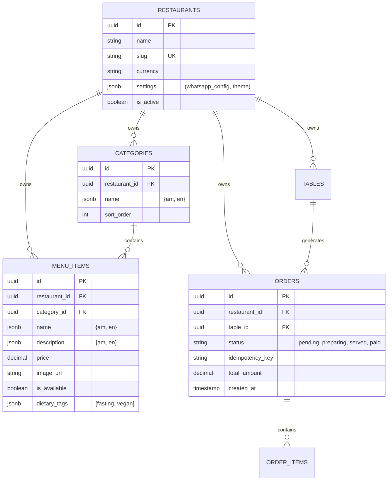

# Phase 2.1: Technical Architecture

**Status:** APPROVED
**Date:** 2026-02-04
**Skill Invoked:** /technical-architecture
**Context:** Defines the system design for "Gebeta" (Offline-First Restaurant Platform).

---

## 1. Technical Requirements Analysis

### Functional Drivers
*   **Offline-First:** Critical. Internet in Ethiopia cuts out frequently. Orders must NOT be lost.
*   **Speed:** Initial menu load < 2s on 3G network.
*   **Multi-Tenancy:** One codebase serving 500+ restaurants. Data isolation is paramount.
*   **Real-time:** Kitchen needs to see orders instantly (when online).

### Performance Targets
*   **LCP (Largest Contentful Paint):** < 2.0s
*   **TTI (Time to Interactive):** < 2.5s
*   **Order Sync Latency:** < 500ms (when online)
*   **Offline Queue Capacity:** Unlimited (IndexedDB)

### Constraints
*   **Devices:** Android 6.0+ (Chrome 80+), Low-end hardware (2GB RAM).
*   **Bandwidth:** Expensive data. Minimize payload size (aggressive image optimization).

---

## 2. Architecture Decision Records (ADRs)

### ADR-001: Offline-First Strategy
*   **Decision:** Use **Dexie.js (IndexedDB)** for local persistence of orders and **TanStack Query** for caching menu data.
*   **Rationale:** `localStorage` (5MB) is too small for images/menus. IndexedDB handles large data. TanStack Query provides built-in `stale-while-revalidate` logic suitable for spotty connections.
*   **Trade-off:** Complexity in sync logic (handling conflicts).

### ADR-002: Multi-Tenancy Approach
*   **Decision:** **Row-Level Security (RLS)** with shared schema.
*   **Rationale:** Creating separate schemas/databases per tenant is unmanageable at 500+ scale. Postgres RLS allows efficient, secure isolation at the database layer.
*   **Implementation:** Every table (except `public_data`) MUST have `restaurant_id`.

### ADR-003: API & State Management
*   **Decision:** **Server Actions** + **Zustand**.
*   **Rationale:** Server Actions provide type safety and reduced client bundle size suitable for low-end devices. Zustand is lighter than Redux (1kb vs >10kb) which matters for 3G networks.

---

## 3. Data Architecture (Schema)

### ER Diagram (Mermaid)



### Storage Strategy
*   **Images:** Supabase Storage (CDN).
*   **Optimization:** All images resized to 800x600 WebP on upload via Edge Function.

---

## 4. System Architecture

### Context Diagram

```mermaid
graph TD
    User[Diner (Mobile)] -->|HTTPS/PWA| CDN[Cloudflare/Vercel]
    CDN -->|Next.js| App[Gebeta App]
    
    Owner[Restaurant Owner] -->|HTTPS| Admin[Admin Dashboard]
    
    App -->|Reads (Cached)| DB[(Supabase DB)]
    App -->|Writes (Sync)| DB
    
    Kitchen[Kitchen Display] -->|Realtime Sub| DB
```

### Modules
1.  **Consumer PWA:** Light mode only, optimized for reading.
2.  **Order Sync Engine:** Background worker (Service Worker) processing IndexedDB queue.
3.  **Admin Portal:** Next.js Dashboard for CRUD operations.

---

## 5. Security Architecture

### Authentication
*   **Admin/Merchants:** Supabase Auth (Email/Password).
*   **Diners:** Anonymous (Session based on Device Fingerprint).

### Authorization (RLS)
*   `public_read`: Anyone can read `menu_items` where `is_available = true`.
*   `tenant_write`: Only authenticated users with `restaurant_id` claim can write to their data.
*   `orders_insert`: Anon users can insert orders (rate-limited).

---

## 6. Implementation Plan

1.  **Database Migration:** Apply `001_initial_schema.sql` (mapped in `Tasks.md`).
2.  **Scaffold Monorepo:** Setup Next.js with `tanstack-query`, `dexie`, `zustand`.
3.  **Core Feature:** Implement `SynchronizationProvider` for offline logic.

---
