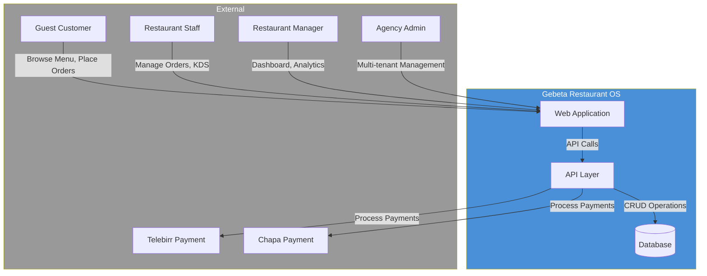
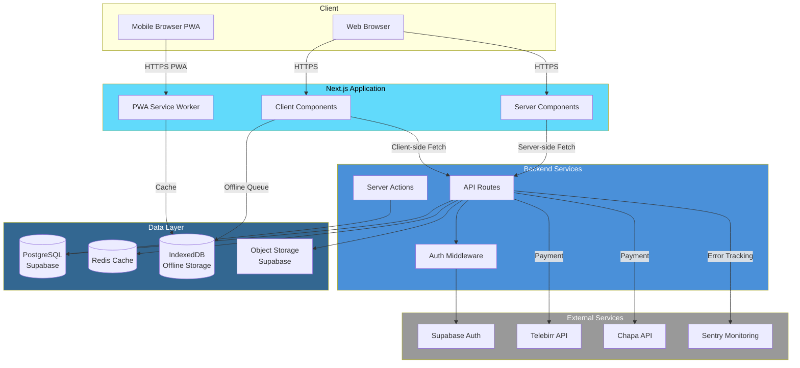
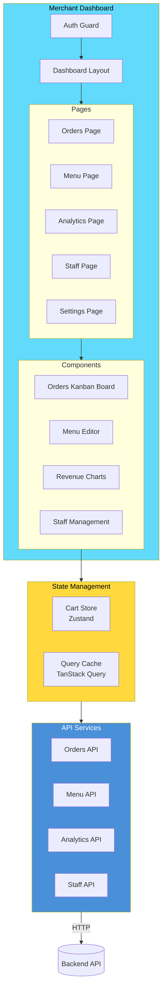
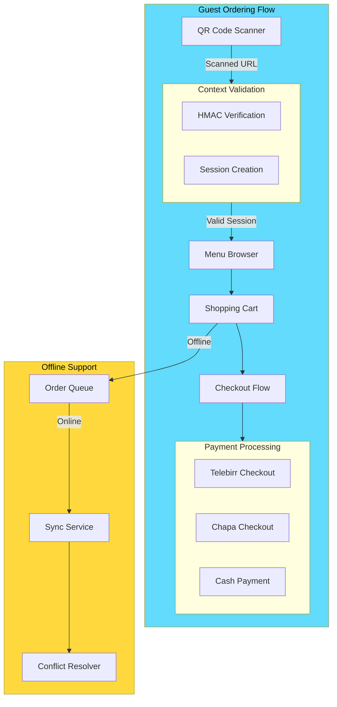
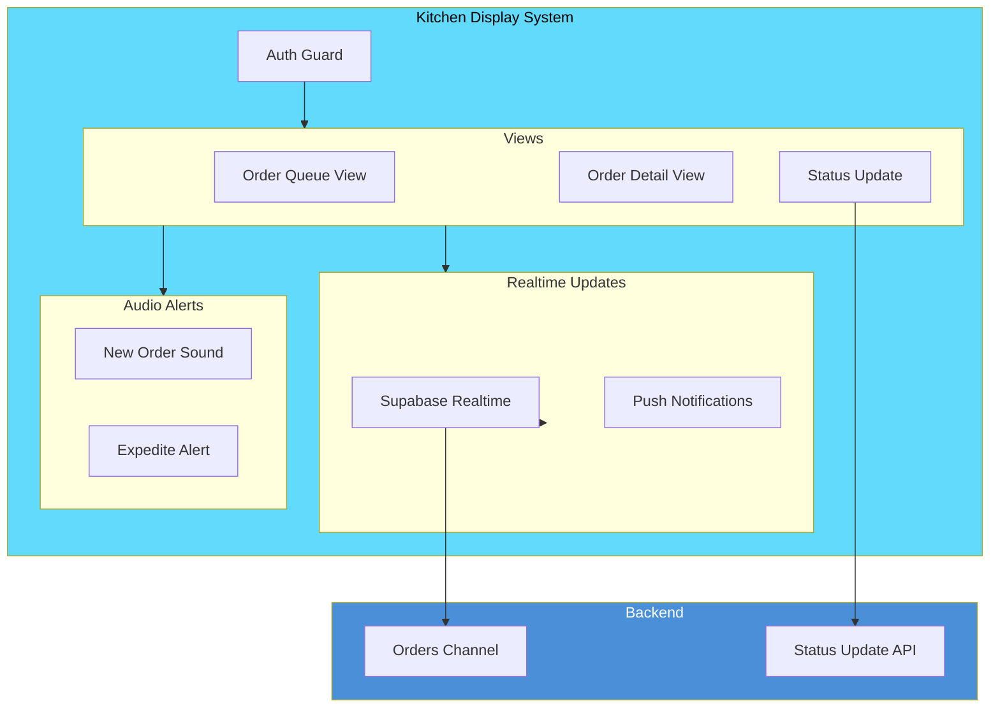
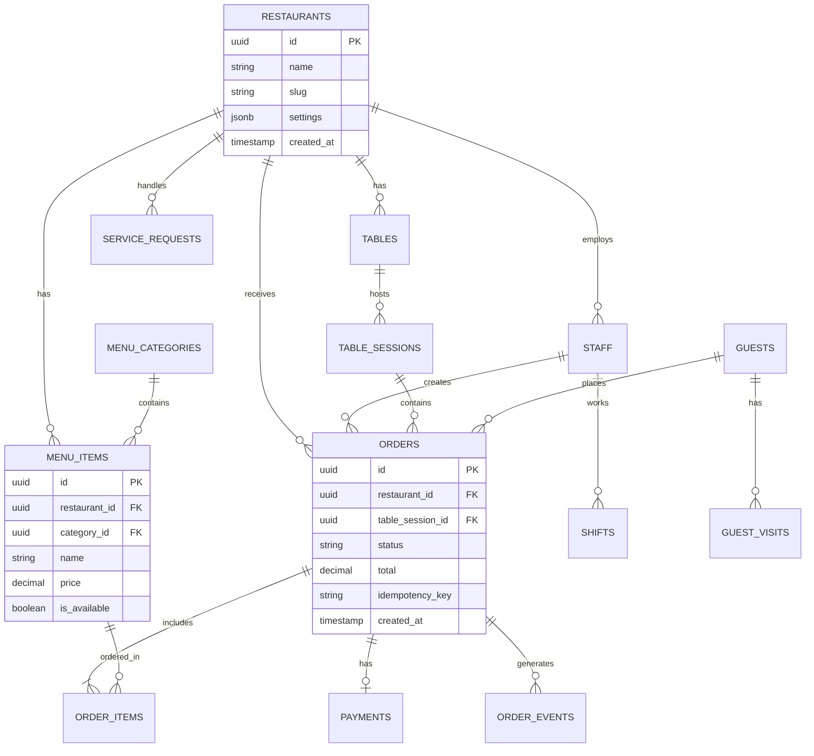
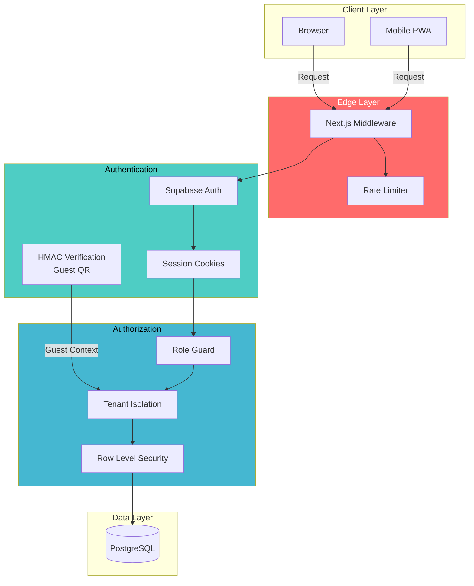
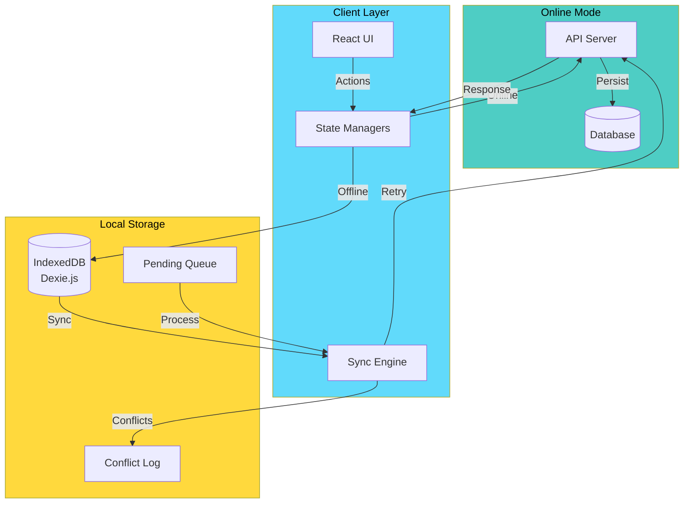
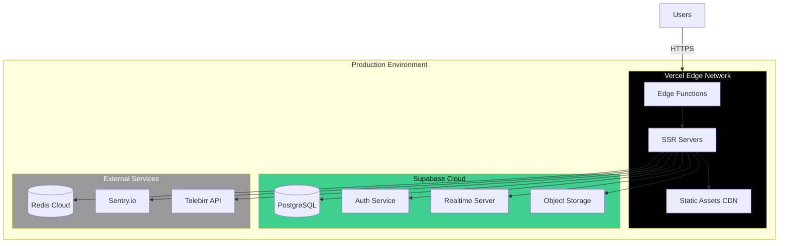

# Gebeta Restaurant OS - Architecture Diagrams

## C4 Model Architecture Documentation

This document provides a comprehensive view of the Gebeta Restaurant OS architecture using the C4 model.

---

## Level 1: System Context Diagram



### System Description

**Gebeta Restaurant OS** is a comprehensive restaurant operating system designed for Addis Ababa, Ethiopia. It provides:

- **Guest Ordering**: QR code-based table ordering for customers
- **Kitchen Display System (KDS)**: Real-time order management for kitchen staff
- **Merchant Dashboard**: Analytics, inventory, and staff management
- **Multi-Tenant SaaS**: Agency model for managing multiple restaurants

---

## Level 2: Container Diagram



### Container Descriptions

| Container | Technology | Description |
|-----------|------------|-------------|
| **Web Browser** | React 19, Next.js 16 | Desktop web application |
| **Mobile Browser PWA** | PWA, Service Worker | Progressive web app for mobile |
| **Server Components** | Next.js RSC | Server-rendered React components |
| **Client Components** | React, Zustand | Interactive client-side components |
| **API Routes** | Next.js API Routes | RESTful API endpoints |
| **Server Actions** | Next.js Server Actions | Form submissions and mutations |
| **PostgreSQL** | Supabase | Primary database with RLS |
| **Redis** | ioredis | Rate limiting and caching |
| **IndexedDB** | Dexie.js | Offline-first data storage |

---

## Level 3: Component Diagram - Merchant Dashboard



---

## Level 3: Component Diagram - Guest Ordering



---

## Level 3: Component Diagram - Kitchen Display System



---

## Database Schema Overview



---

## Security Architecture



---

## Offline-First Architecture



### Sync Strategy

1. **Last-Write-Wins**: Conflicts resolved by `updated_at` timestamp
2. **Idempotency Keys**: Prevent duplicate operations
3. **Version Tracking**: Track entity versions for conflict detection
4. **Audit Trail**: Log all sync operations for debugging

---

## Deployment Architecture



---

## Multi-Tenant Architecture

```mermaid
graph TB
    subgraph Agency[Agency Model]
        AgencyAdmin[Agency Admin]
        AgencyUsers[Agency Users]
    end

    subgraph Tenants[Restaurant Tenants]
        Restaurant1[Restaurant A]
        Restaurant2[Restaurant B]
        Restaurant3[Restaurant C]
    end

    subgraph DataIsolation[Data Isolation]
        RLS[Row Level Security]
        StaffMembership[Staff Membership]
    end

    subgraph Database[(Database)]
        OrdersTable[Orders Table]
        MenuTable[Menu Table]
        StaffTable[Staff Table]
    end

    AgencyAdmin -->|Manage All| AgencyUsers
    AgencyUsers -->|Access| Restaurant1
    AgencyUsers -->|Access| Restaurant2
    
    Restaurant1 -->|restaurant_id| RLS
    Restaurant2 -->|restaurant_id| RLS
    Restaurant3 -->|restaurant_id| RLS
    
    RLS --> StaffMembership
    StaffMembership -->|Filter| OrdersTable
    StaffMembership -->|Filter| MenuTable
    StaffMembership -->|Filter| StaffTable

    style Agency fill:#9B59B6,color:#fff
    style Tenants fill:#3498DB,color:#fff
    style DataIsolation fill:#E74C3C,color:#fff
```

---

## Tech Stack Summary

| Layer | Technology | Purpose |
|-------|------------|---------|
| **Frontend** | Next.js 16, React 19 | SSR, RSC, App Router |
| **Styling** | Tailwind CSS 4 | Utility-first CSS |
| **State** | Zustand, TanStack Query | Client/Server state |
| **Backend** | Next.js API Routes | RESTful endpoints |
| **Database** | PostgreSQL (Supabase) | Primary datastore |
| **Auth** | Supabase Auth | Authentication, RLS |
| **Offline** | Dexie.js, Service Worker | PWA, offline-first |
| **Cache** | Redis | Rate limiting, sessions |
| **Monitoring** | Sentry | Error tracking |
| **Payments** | Telebirr, Chapa | Ethiopian payment gateways |

---

*Generated for Gebeta Restaurant OS - February 2026*