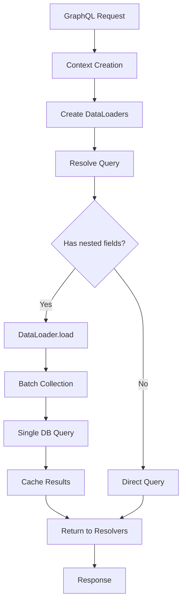
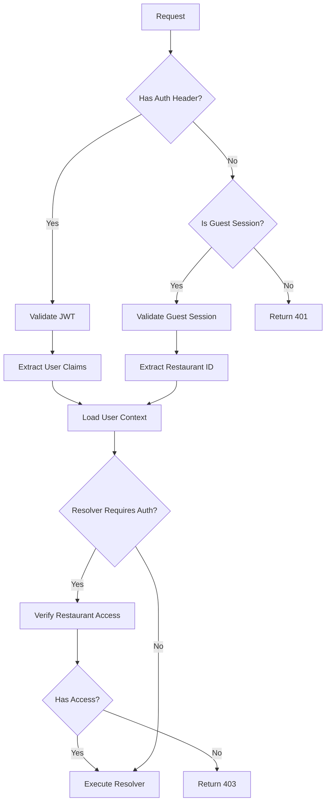

# GraphQL Implementation Audit Report

**Project:** lole Restaurant OS  
**Date:** 2026-03-17  
**Auditor:** GraphQL Expert (SKILLS/development/graphql)  
**Scope:** Schema design, resolver logic, query efficiency, security vulnerabilities

---

## Executive Summary

This audit identified **15 issues** across the GraphQL implementation:

| Severity    | Count |
| ----------- | ----- |
| 🔴 Critical | 4     |
| 🟠 High     | 4     |
| 🟡 Medium   | 4     |
| 🟢 Low      | 3     |

**Top Priority Issues:**

1. No DataLoader implementation - guaranteed N+1 query problems
2. Missing authorization checks in resolvers
3. Sensitive data exposed in schema (pinCode)
4. No query complexity/depth limiting in subgraph servers

---

## Detailed Findings

### 🔴 CRITICAL-001: No DataLoader Implementation (N+1 Query Problem)

**Severity:** Critical  
**Location:** All resolver files  
**Impact:** Performance degradation, potential DoS under load

**Description:**
The GraphQL skill explicitly warns: "Each resolver makes separate database queries - USE DATALOADER". The current implementation has no DataLoader batching, causing N+1 queries on every nested field resolution.

**Affected Code:**

```typescript
// src/domains/menu/resolvers.ts:111-115
modifierGroups: async (menuItem: Record<string, unknown>) => {
    const id = menuItem.id as string;
    if (!id) return [];
    return menuRepository.getModifierGroups(id); // N+1: Called for EACH menu item
},
```

```typescript
// src/domains/orders/resolvers.ts:250-252
items: async (order: { id: string }) => {
    return ordersService.getOrderItems(order.id); // N+1: Called for EACH order
},
```

**Remediation:**

Create a DataLoader factory:

```typescript
// src/lib/graphql/dataloaders.ts
import DataLoader from 'dataloader';
import { menuRepository } from '@/domains/menu/repository';
import { ordersService } from '@/domains/orders/service';

export interface DataLoaders {
    menuItems: DataLoader<string, MenuItem | null>;
    modifierGroups: DataLoader<string, ModifierGroup[]>;
    modifierOptions: DataLoader<string, ModifierOption[]>;
    orderItems: DataLoader<string, OrderItem[]>;
    categories: DataLoader<string, Category | null>;
}

export function createDataLoaders(): DataLoaders {
    return {
        menuItems: new DataLoader(async (ids: readonly string[]) => {
            const items = await menuRepository.getMenuItemsByIds([...ids]);
            const itemMap = new Map(items.map(item => [item.id, item]));
            return ids.map(id => itemMap.get(id) || null);
        }),

        modifierGroups: new DataLoader(async (menuItemIds: readonly string[]) => {
            const groups = await menuRepository.getModifierGroupsByMenuItemIds([...menuItemIds]);
            // Group by menu_item_id
            const groupsByMenuItem = new Map<string, ModifierGroup[]>();
            for (const group of groups) {
                const existing = groupsByMenuItem.get(group.menu_item_id) || [];
                existing.push(group);
                groupsByMenuItem.set(group.menu_item_id, existing);
            }
            return menuItemIds.map(id => groupsByMenuItem.get(id) || []);
        }),

        modifierOptions: new DataLoader(async (groupIds: readonly string[]) => {
            const options = await menuRepository.getModifierOptionsByGroupIds([...groupIds]);
            const optionsByGroup = new Map<string, ModifierOption[]>();
            for (const option of options) {
                const existing = optionsByGroup.get(option.modifier_group_id) || [];
                existing.push(option);
                optionsByGroup.set(option.modifier_group_id, existing);
            }
            return groupIds.map(id => optionsByGroup.get(id) || []);
        }),

        orderItems: new DataLoader(async (orderIds: readonly string[]) => {
            const items = await ordersService.getOrderItemsByOrderIds([...orderIds]);
            const itemsByOrder = new Map<string, OrderItem[]>();
            for (const item of items) {
                const existing = itemsByOrder.get(item.order_id) || [];
                existing.push(item);
                itemsByOrder.set(item.order_id, existing);
            }
            return orderIds.map(id => itemsByOrder.get(id) || []);
        }),

        categories: new DataLoader(async (ids: readonly string[]) => {
            const categories = await menuRepository.getCategoriesByIds([...ids]);
            const categoryMap = new Map(categories.map(cat => [cat.id, cat]));
            return ids.map(id => categoryMap.get(id) || null);
        }),
    };
}
```

Update context to include DataLoaders:

```typescript
// src/lib/graphql/context.ts
import { DataLoaders } from './dataloaders';

export interface GraphQLContext {
    token: string | null;
    guestSession: string | null;
    user: {
        id: string;
        restaurantId?: string;
        role?: string;
    } | null;
    dataLoaders: DataLoaders; // Add this
}
```

Update resolvers to use DataLoaders:

```typescript
// src/domains/menu/resolvers.ts
export const menuResolvers = {
    MenuItem: {
        modifierGroups: async (
            menuItem: Record<string, unknown>,
            _args: unknown,
            context: GraphQLContext
        ) => {
            const id = menuItem.id as string;
            if (!id) return [];
            return context.dataLoaders.modifierGroups.load(id);
        },
        category: async (
            menuItem: Record<string, unknown>,
            _args: unknown,
            context: GraphQLContext
        ) => {
            const categoryId = menuItem.category_id as string;
            if (!categoryId) return null;
            return context.dataLoaders.categories.load(categoryId);
        },
    },

    ModifierGroup: {
        options: async (
            group: Record<string, unknown>,
            _args: unknown,
            context: GraphQLContext
        ) => {
            const id = group.id as string;
            if (!id) return [];
            return context.dataLoaders.modifierOptions.load(id);
        },
    },
};
```

---

### 🔴 CRITICAL-002: Missing Authorization in Resolvers

**Severity:** Critical  
**Location:** All resolver files  
**Impact:** Unauthorized data access, tenant isolation violation

**Description:**
Per AGENTS.md: "ALWAYS validate tenant scope server-side" and "NEVER bypass tenant isolation". The resolvers accept `restaurantId` from client arguments without validating that the authenticated user has access to that restaurant.

**Affected Code:**

```typescript
// src/domains/orders/resolvers.ts:33-48
orders: async (
    _: unknown,
    args: {
        restaurantId: string; // Client-provided - NOT VALIDATED
        status?: string;
        tableId?: string;
        first?: number;
        after?: string;
    }
) => {
    // NO AUTHORIZATION CHECK
    const orders = await ordersService.getOrders(args.restaurantId, {...});
    return {...};
},
```

**Remediation:**

Create an authorization middleware for resolvers:

```typescript
// src/lib/graphql/authz.ts
import { GraphQLContext } from './context';
import { verifyTenantScope } from '@/lib/api/authz';

export interface AuthorizedContext extends GraphQLContext {
    user: NonNullable<GraphQLContext['user']>;
}

/**
 * Throws an error if the user is not authenticated
 */
export function requireAuth(context: GraphQLContext): AuthorizedContext {
    if (!context.user) {
        throw new GraphQLError('Unauthorized', {
            extensions: { code: 'UNAUTHORIZED', http: { status: 401 } },
        });
    }
    return context as AuthorizedContext;
}

/**
 * Throws an error if the user doesn't have access to the restaurant
 */
export async function requireRestaurantAccess(
    context: GraphQLContext,
    restaurantId: string
): Promise<AuthorizedContext> {
    const authContext = requireAuth(context);

    // Verify user has access to this restaurant
    const { allowed, reason } = await verifyTenantScope(authContext.user.id, restaurantId);

    if (!allowed) {
        throw new GraphQLError(reason || 'Access denied to restaurant', {
            extensions: {
                code: 'FORBIDDEN',
                http: { status: 403 },
                restaurantId,
            },
        });
    }

    return authContext;
}

/**
 * Middleware wrapper for query resolvers that require restaurant access
 */
export function withRestaurantAccess<TArgs extends { restaurantId: string }, TResult>(
    resolver: (parent: unknown, args: TArgs, context: AuthorizedContext) => Promise<TResult>
) {
    return async (parent: unknown, args: TArgs, context: GraphQLContext) => {
        const authContext = await requireRestaurantAccess(context, args.restaurantId);
        return resolver(parent, args, authContext);
    };
}
```

Update resolvers with authorization:

```typescript
// src/domains/orders/resolvers.ts
import { withRestaurantAccess, requireAuth } from '@/lib/graphql/authz';

export const ordersResolvers = {
    Query: {
        orders: withRestaurantAccess(async (_: unknown, args, context) => {
            const orders = await ordersService.getOrders(args.restaurantId, {
                status: args.status ? mapOrderStatus(args.status) : undefined,
                tableId: args.tableId,
                limit: args.first,
                offset: args.after ? parseInt(args.after, 10) : 0,
            });
            // ... rest of implementation
        }),

        order: async (_: unknown, args: { id: string }, context: GraphQLContext) => {
            const authContext = requireAuth(context);
            const order = await ordersService.getOrder(args.id);

            // Verify tenant isolation
            if (order && order.restaurant_id !== authContext.user.restaurantId) {
                throw new GraphQLError('Access denied to this order', {
                    extensions: { code: 'FORBIDDEN', http: { status: 403 } },
                });
            }

            return order;
        },

        activeOrders: withRestaurantAccess(async (_: unknown, args) => {
            return ordersService.getActiveOrders(args.restaurantId);
        }),

        kdsOrders: withRestaurantAccess(async (_: unknown, args) => {
            return ordersService.getKDSOrders(args.restaurantId, args.station);
        }),
    },

    Mutation: {
        createOrder: async (
            _: unknown,
            args: { input: CreateOrderInput },
            context: GraphQLContext
        ) => {
            const authContext = await requireRestaurantAccess(context, args.input.restaurantId);

            const order = await ordersService.createOrder({
                ...args.input,
                staffId: authContext.user.id, // Use authenticated user
            });
            // ... rest of implementation
        },
    },
};
```

---

### 🔴 CRITICAL-003: Sensitive Data Exposed in Schema

**Severity:** Critical  
**Location:** [`graphql/subgraphs/staff.graphql:21`](graphql/subgraphs/staff.graphql:21)  
**Impact:** Security breach - PIN codes exposed via API

**Description:**
The `Staff` type exposes `pinCode` field which contains sensitive authentication credentials. This should never be exposed through the API.

**Affected Code:**

```graphql
# graphql/subgraphs/staff.graphql:15-28
type Staff @key(fields: "id") {
    id: ID!
    restaurantId: ID!
    userId: ID!
    fullName: String!
    role: StaffRole!
    pinCode: String # ❌ CRITICAL: Sensitive data exposed
    isActive: Boolean!
    hireDate: String
    phone: String
    email: String
    createdAt: String!
    updatedAt: String!
}
```

**Remediation:**

Remove the field from the schema:

```graphql
# graphql/subgraphs/staff.graphql
type Staff @key(fields: "id") {
    id: ID!
    restaurantId: ID!
    userId: ID!
    fullName: String!
    role: StaffRole!
    # pinCode removed - never expose authentication credentials
    isActive: Boolean!
    hireDate: String
    phone: String
    email: String
    createdAt: String!
    updatedAt: String!
}
```

If PIN verification is needed, use a dedicated mutation:

```graphql
# Add to staff.graphql
type Mutation {
    verifyPin(input: VerifyPinInput!): PinVerificationResult!
}

input VerifyPinInput {
    restaurantId: ID!
    pinCode: String!
}

type PinVerificationResult {
    success: Boolean!
    staff: Staff
    error: loleError
}
```

---

### 🔴 CRITICAL-004: No Query Complexity/Depth Limiting in Subgraphs

**Severity:** Critical  
**Location:** All subgraph route files  
**Impact:** DoS vulnerability through expensive queries

**Description:**
The GraphQL skill warns: "Deeply nested queries can DoS your server - LIMIT QUERY DEPTH AND COMPLEXITY". While the Apollo Router has limits configured, individual subgraph servers have no protection.

**Affected Code:**

```typescript
// src/app/api/subgraphs/orders/route.ts:20-24
const server = new ApolloServer<GraphQLContext>({
    typeDefs: ordersSchema,
    resolvers: ordersResolvers,
    introspection: process.env.NODE_ENV !== 'production',
    // ❌ No depth limiting
    // ❌ No complexity analysis
});
```

**Remediation:**

Add query complexity and depth limiting:

```typescript
// src/lib/graphql/apollo-config.ts
import { ApolloServer } from '@apollo/server';
import { depthLimit } from '@graphql-tools/depth-limit';
import { createComplexityLimitRule } from 'graphql-validation-complexity';

export interface SubgraphConfig {
    typeDefs: string;
    resolvers: Record<string, unknown>;
}

const DEPTH_LIMIT = 10;
const COMPLEXITY_LIMIT = 1000;

const complexityRule = createComplexityLimitRule(COMPLEXITY_LIMIT, {
    onCost: (cost: number) => {
        console.log(`Query complexity: ${cost}`);
    },
    formatErrorMessage: (cost: number) =>
        `Query complexity ${cost} exceeds maximum allowed ${COMPLEXITY_LIMIT}`,
});

export function createSubgraphServer<TContext>(config: SubgraphConfig) {
    return new ApolloServer<TContext>({
        typeDefs: config.typeDefs,
        resolvers: config.resolvers,
        introspection: process.env.NODE_ENV !== 'production',

        // Add validation rules for security
        validationRules: [
            depthLimit(DEPTH_LIMIT, {
                onTooDeep: (depth: number) => {
                    console.warn(`Query depth ${depth} exceeds limit ${DEPTH_LIMIT}`);
                },
            }),
            complexityRule,
        ],

        // Enable CSRF prevention
        csrfPrevention: true,

        // Configure error formatting
        formatError: (formattedError, error) => {
            // Log internal errors
            if (formattedError.extensions?.code === 'INTERNAL_SERVER_ERROR') {
                console.error('GraphQL Internal Error:', error);
            }

            // Don't expose internal errors to clients
            if (process.env.NODE_ENV === 'production') {
                if (!formattedError.extensions?.code) {
                    return new GraphQLError('Internal server error', {
                        extensions: { code: 'INTERNAL_SERVER_ERROR' },
                    });
                }
            }

            return formattedError;
        },
    });
}
```

Update subgraph routes:

```typescript
// src/app/api/subgraphs/orders/route.ts
import { createSubgraphServer } from '@/lib/graphql/apollo-config';

const server = createSubgraphServer<GraphQLContext>({
    typeDefs: ordersSchema,
    resolvers: ordersResolvers,
});
```

---

### 🟠 HIGH-001: Missing Tenant Isolation in \_\_resolveReference

**Severity:** High  
**Location:** All resolver files with `__resolveReference`  
**Impact:** Cross-tenant data access

**Description:**
Federation reference resolvers don't validate tenant isolation. An attacker could fetch entities from other restaurants by guessing IDs.

**Affected Code:**

```typescript
// src/domains/orders/resolvers.ts:246-249
Order: {
    __resolveReference(reference: { id: string }) {
        return ordersService.getOrder(reference.id); // No tenant check
    },
},
```

**Remediation:**

Add tenant validation to reference resolvers:

```typescript
// src/domains/orders/resolvers.ts
Order: {
    __resolveReference: async (reference: { id: string }, context: GraphQLContext) => {
        const order = await ordersService.getOrder(reference.id);

        // Validate tenant isolation
        if (order && context.user?.restaurantId) {
            if (order.restaurant_id !== context.user.restaurantId) {
                console.error(`Tenant isolation violation: User ${context.user.id} attempted to access order ${reference.id}`);
                return null;
            }
        }

        return order;
    },
},
```

---

### 🟠 HIGH-002: Inconsistent Error Handling

**Severity:** High  
**Location:** All resolver files  
**Impact:** Information leakage, poor debugging

**Description:**
Error handling is inconsistent across resolvers. Some return structured errors, others throw, and some return null. This makes client-side error handling unpredictable.

**Affected Code:**

```typescript
// src/domains/menu/resolvers.ts:51-60 - Returns error object
createMenuItem: async (_: unknown, _args: { input: Record<string, unknown> }) => {
    return {
        success: false,
        menuItem: null,
        error: { code: 'NOT_IMPLEMENTED', message: 'createMenuItem mutation not implemented' },
    };
},

// src/domains/orders/resolvers.ts:107-116 - Catches and returns error
} catch (error) {
    return {
        success: false,
        order: null,
        error: {
            code: 'CREATE_ORDER_FAILED',
            message: error instanceof Error ? error.message : 'Failed to create order',
        },
    };
}
```

**Remediation:**

Create standardized error handling:

```typescript
// src/lib/graphql/errors.ts
import { GraphQLError } from 'graphql';

export type ErrorCode =
    | 'UNAUTHORIZED'
    | 'FORBIDDEN'
    | 'NOT_FOUND'
    | 'VALIDATION_ERROR'
    | 'TENANT_ISOLATION_VIOLATION'
    | 'INTERNAL_ERROR'
    | 'NOT_IMPLEMENTED';

export class loleGraphQLError extends GraphQLError {
    constructor(
        message: string,
        public code: ErrorCode,
        public details?: Record<string, unknown>
    ) {
        super(message, {
            extensions: {
                code,
                ...details,
            },
        });
    }
}

export function createErrorResult(code: ErrorCode, message: string, messageAm?: string) {
    return {
        success: false,
        error: {
            code,
            message,
            messageAm,
        },
    };
}

// Usage in resolvers:
} catch (error) {
    if (error instanceof loleGraphQLError) {
        return createErrorResult(error.code, error.message);
    }
    return createErrorResult('INTERNAL_ERROR', 'An unexpected error occurred');
}
```

---

### 🟠 HIGH-003: Missing Input Validation

**Severity:** High  
**Location:** All resolver files  
**Impact:** Injection attacks, invalid data

**Description:**
Per AGENTS.md: "ALWAYS validate input with Zod schemas before processing". Resolvers accept raw input without validation.

**Affected Code:**

```typescript
// src/domains/orders/resolvers.ts:80-86
createOrder: async (_: unknown, args: { input: CreateOrderInput }) => {
    try {
        // No validation of args.input
        const order = await ordersService.createOrder({
            ...args.input,
            staffId: 'staff-id-from-jwt',
        });
```

**Remediation:**

Add Zod validation:

```typescript
// src/lib/validators/graphql.ts
import { z } from 'zod';

export const CreateOrderInputSchema = z.object({
    restaurantId: z.string().uuid(),
    tableId: z.string().uuid().optional(),
    type: z.enum(['DINE_IN', 'TAKEAWAY', 'DELIVERY']),
    items: z.array(z.object({
        menuItemId: z.string().uuid(),
        quantity: z.int().positive().max(100),
        modifiers: z.record(z.unknown()).optional(),
        notes: z.string().max(500).optional(),
        idempotencyKey: z.string().min(1),
    })).min(1).max(100),
    notes: z.string().max(1000).optional(),
    idempotencyKey: z.string().min(1),
});

export const UpdateOrderStatusInputSchema = z.object({
    id: z.string().uuid(),
    status: z.enum(['PENDING', 'CONFIRMED', 'PREPARING', 'READY', 'SERVED', 'CANCELLED']),
});

// In resolver:
import { CreateOrderInputSchema } from '@/lib/validators/graphql';

createOrder: async (_: unknown, args: { input: unknown }, context: GraphQLContext) => {
    const authContext = requireAuth(context);

    // Validate input
    const parsed = CreateOrderInputSchema.safeParse(args.input);
    if (!parsed.success) {
        return createErrorResult('VALIDATION_ERROR', parsed.error.message);
    }

    const order = await ordersService.createOrder({
        ...parsed.data,
        staffId: authContext.user.id,
    });
    // ...
},
```

---

### 🟠 HIGH-004: Introspection Not Explicitly Controlled

**Severity:** High  
**Location:** All subgraph route files  
**Impact:** Schema exposure in production

**Description:**
The GraphQL skill warns: "Introspection enabled in production exposes your schema". While currently conditional on `NODE_ENV`, this should be explicitly controlled and logged.

**Affected Code:**

```typescript
// src/app/api/subgraphs/orders/route.ts:23
introspection: process.env.NODE_ENV !== 'production',
```

**Remediation:**

Add explicit control with logging:

```typescript
// src/lib/graphql/config.ts
const ENABLE_INTROSPECTION =
    process.env.GRAPHQL_ENABLE_INTROSPECTION === 'true' || process.env.NODE_ENV !== 'production';

if (ENABLE_INTROSPECTION && process.env.NODE_ENV === 'production') {
    console.warn('⚠️ GraphQL introspection is ENABLED in production. This should be disabled.');
}

export const graphqlConfig = {
    introspection: ENABLE_INTROSPECTION,
    debug: process.env.NODE_ENV !== 'production',
} as const;
```

---

### 🟡 MEDIUM-001: JSON Scalar Without Validation

**Severity:** Medium  
**Location:** [`graphql/subgraphs/orders.graphql:7`](graphql/subgraphs/orders.graphql:7)  
**Impact:** Unexpected data types, potential injection

**Description:**
The JSON scalar is used without proper validation or type constraints. This can lead to unexpected data shapes.

**Affected Code:**

```graphql
# graphql/subgraphs/orders.graphql:7
scalar JSON @specifiedBy(url: "https://specs.apollo.dev/graphqlspec/current/#sec-Scalars")
```

**Remediation:**

Add a custom JSON scalar with validation:

```typescript
// src/lib/graphql/scalars/json.ts
import { GraphQLScalarType, GraphQLError, Kind } from 'graphql';

const MAX_JSON_SIZE = 10240; // 10KB

export const JSONScalar = new GraphQLScalarType({
    name: 'JSON',
    description: 'JSON value with size validation',

    serialize(value: unknown) {
        return value;
    },

    parseValue(value: unknown) {
        // Validate size
        const stringified = JSON.stringify(value);
        if (stringified.length > MAX_JSON_SIZE) {
            throw new GraphQLError(`JSON value exceeds maximum size of ${MAX_JSON_SIZE} bytes`);
        }

        // Validate it's a valid JSON-serializable value
        if (
            value !== null &&
            typeof value !== 'object' &&
            typeof value !== 'string' &&
            typeof value !== 'number' &&
            typeof value !== 'boolean' &&
            !Array.isArray(value)
        ) {
            throw new GraphQLError('Invalid JSON value');
        }

        return value;
    },

    parseLiteral(ast) {
        if (ast.kind === Kind.STRING) {
            try {
                return JSON.parse(ast.value);
            } catch {
                throw new GraphQLError('Invalid JSON string');
            }
        }

        if (ast.kind === Kind.INT) {
            return parseInt(ast.value, 10);
        }

        if (ast.kind === Kind.FLOAT) {
            return parseFloat(ast.value);
        }

        if (ast.kind === Kind.BOOLEAN) {
            return ast.value;
        }

        if (ast.kind === Kind.NULL) {
            return null;
        }

        if (ast.kind === Kind.LIST || ast.kind === Kind.OBJECT) {
            return ast;
        }

        throw new GraphQLError(`Unexpected literal type: ${ast.kind}`);
    },
});
```

---

### 🟡 MEDIUM-002: Missing Pagination Defaults and Limits

**Severity:** Medium  
**Location:** [`graphql/subgraphs/orders.graphql:137-139`](graphql/subgraphs/orders.graphql:137)  
**Impact:** Unbounded result sets, memory exhaustion

**Description:**
Pagination has a default of 20 but no maximum limit. Clients could request unlimited records.

**Affected Code:**

```graphql
# graphql/subgraphs/orders.graphql:137-139
orders(
    restaurantId: ID!
    status: OrderStatus
    tableId: ID
    first: Int = 20  # No maximum
    after: String
): OrderConnection!
```

**Remediation:**

Add maximum limits in schema and validation:

```graphql
# graphql/subgraphs/orders.graphql
orders(
    restaurantId: ID!
    status: OrderStatus
    tableId: ID
    first: Int = 20
    after: String
): OrderConnection! @deprecated(reason: "Use ordersPaginated with max limit")

# Or add a directive for limit enforcement
```

```typescript
// In resolvers, enforce maximum:
const MAX_PAGE_SIZE = 100;

orders: withRestaurantAccess(async (_: unknown, args) => {
    const limit = Math.min(args.first ?? 20, MAX_PAGE_SIZE);

    const orders = await ordersService.getOrders(args.restaurantId, {
        status: args.status ? mapOrderStatus(args.status) : undefined,
        tableId: args.tableId,
        limit,
        offset: args.after ? parseInt(args.after, 10) : 0,
    });
    // ...
}),
```

---

### 🟡 MEDIUM-003: Federation Reference Resolvers Return Null

**Severity:** Medium  
**Location:** Multiple resolver files  
**Impact:** Broken federation, missing data

**Description:**
Many `__resolveReference` implementations return `null` instead of fetching data, breaking federation entity resolution.

**Affected Code:**

```typescript
// src/domains/menu/resolvers.ts:118-122
Category: {
    __resolveReference(_reference: { id: string }) {
        // Would need getCategory method
        return null; // ❌ Always returns null
    },
```

```typescript
// src/domains/payments/resolvers.ts:29-33
Payment: {
    __resolveReference(_reference: { id: string }) {
        // TODO: Implement with payments repository
        return null; // ❌ Always returns null
    },
},
```

**Remediation:**

Implement proper reference resolution:

```typescript
// src/domains/menu/resolvers.ts
Category: {
    __resolveReference: async (reference: { id: string }, context: GraphQLContext) => {
        const category = await context.dataLoaders.categories.load(reference.id);

        // Validate tenant isolation
        if (category && context.user?.restaurantId) {
            if (category.restaurant_id !== context.user.restaurantId) {
                return null;
            }
        }

        return category;
    },
},
```

---

### 🟡 MEDIUM-004: Hardcoded Staff ID in Mutations

**Severity:** Medium  
**Location:** [`src/domains/orders/resolvers.ts:85`](src/domains/orders/resolvers.ts:85)  
**Impact:** Audit trail corruption, incorrect attribution

**Description:**
Mutations use hardcoded `'staff-id-from-jwt'` instead of the actual authenticated user ID.

**Affected Code:**

```typescript
// src/domains/orders/resolvers.ts:85
staffId: 'staff-id-from-jwt', // TODO: Get from context
```

**Remediation:**

Use authenticated user from context:

```typescript
createOrder: async (_: unknown, args: { input: CreateOrderInput }, context: GraphQLContext) => {
    const authContext = requireAuth(context);

    const order = await ordersService.createOrder({
        ...args.input,
        staffId: authContext.user.id, // Use actual user ID
    });
    // ...
},
```

---

### 🟢 LOW-001: Missing Deprecation on Legacy Fields

**Severity:** Low  
**Location:** Schema files  
**Impact:** Client confusion, migration difficulty

**Description:**
No fields are marked as deprecated, making API evolution difficult.

**Remediation:**

Add deprecation directives:

```graphql
type Order {
    # ... other fields
    guestId: ID @deprecated(reason: "Use guest field for full guest data")
    guest: Guest
}
```

---

### 🟢 LOW-002: Missing Description Documentation

**Severity:** Low  
**Location:** All schema files  
**Impact:** Poor API discoverability

**Description:**
Types and fields lack descriptions, making the schema harder to use.

**Remediation:**

Add descriptions:

```graphql
"""
Represents a customer order in the restaurant system
"""
type Order @key(fields: "id") {
    """
    Unique identifier for the order
    """
    id: ID!

    """
    The restaurant this order belongs to
    """
    restaurantId: ID!

    """
    Human-readable order number (e.g., '20260317-0001')
    """
    orderNumber: String!

    """
    Current status of the order
    """
    status: OrderStatus!

    # ... etc
}
```

---

### 🟢 LOW-003: Missing Query/Mutation Descriptions

**Severity:** Low  
**Location:** All schema files  
**Impact:** Poor API documentation

**Remediation:**

Add operation descriptions:

```graphql
type Query {
    """
    Retrieve orders for a restaurant with optional filtering
    """
    orders(
        """
        The restaurant to fetch orders for
        """
        restaurantId: ID!
        """
        Filter by order status
        """
        status: OrderStatus
        """
        Filter by table
        """
        tableId: ID
        """
        Number of results to return (max 100)
        """
        first: Int = 20
        """
        Pagination cursor
        """
        after: String
    ): OrderConnection!
}
```

---

## Architecture Recommendations

### 1. DataLoader Architecture



### 2. Authorization Flow



---

## Implementation Priority

### Phase 1: Critical Security Fixes (Immediate)

1. Remove `pinCode` from Staff schema
2. Add authorization checks to all resolvers
3. Implement DataLoader for N+1 prevention
4. Add query complexity/depth limiting

### Phase 2: High Priority (Within Sprint)

1. Add input validation with Zod
2. Implement proper error handling
3. Fix federation reference resolvers
4. Add tenant isolation to reference resolvers

### Phase 3: Medium Priority (Next Sprint)

1. Add JSON scalar validation
2. Implement pagination limits
3. Fix hardcoded staff IDs
4. Add explicit introspection control

### Phase 4: Low Priority (Backlog)

1. Add schema documentation
2. Add deprecation notices
3. Improve error messages

---

## Files Requiring Changes

| File                                 | Changes Required                        |
| ------------------------------------ | --------------------------------------- |
| `graphql/subgraphs/staff.graphql`    | Remove pinCode field                    |
| `graphql/subgraphs/orders.graphql`   | Add pagination limits, descriptions     |
| `graphql/subgraphs/menu.graphql`     | Add descriptions                        |
| `graphql/subgraphs/payments.graphql` | Add descriptions                        |
| `graphql/subgraphs/guests.graphql`   | Add descriptions                        |
| `src/lib/graphql/context.ts`         | Add DataLoaders to context              |
| `src/lib/graphql/dataloaders.ts`     | **NEW FILE** - DataLoader factory       |
| `src/lib/graphql/authz.ts`           | **NEW FILE** - Authorization helpers    |
| `src/lib/graphql/errors.ts`          | **NEW FILE** - Error handling           |
| `src/lib/graphql/apollo-config.ts`   | **NEW FILE** - Server configuration     |
| `src/lib/graphql/scalars/json.ts`    | **NEW FILE** - Custom JSON scalar       |
| `src/lib/validators/graphql.ts`      | **NEW FILE** - Input validation schemas |
| `src/domains/orders/resolvers.ts`    | Add auth, DataLoader, validation        |
| `src/domains/menu/resolvers.ts`      | Add auth, DataLoader, validation        |
| `src/domains/payments/resolvers.ts`  | Implement resolvers with auth           |
| `src/domains/guests/resolvers.ts`    | Implement resolvers with auth           |
| `src/domains/staff/resolvers.ts`     | Implement resolvers with auth           |
| `src/app/api/subgraphs/*/route.ts`   | Use shared Apollo config                |

---

## Testing Recommendations

1. **Unit Tests for DataLoaders**
    - Test batching behavior
    - Test caching behavior
    - Test error handling

2. **Integration Tests for Authorization**
    - Test tenant isolation
    - Test role-based access
    - Test guest session access

3. **Load Tests for Query Complexity**
    - Test deeply nested queries are rejected
    - Test high-complexity queries are rejected
    - Test rate limiting

4. **Security Tests**
    - Test unauthorized access attempts
    - Test cross-tenant access attempts
    - Test injection attempts

---

## References

- [Apollo Federation 2 Documentation](https://www.apollographql.com/docs/federation/)
- [DataLoader Best Practices](https://github.com/graphql/dataloader/blob/main/README.md)
- [GraphQL Security Checklist](https://graphql.org/learn/security/)
- [Apollo Server Security](https://www.apollographql.com/docs/apollo-server/security/)
- Project Rules: `AGENTS.md`, `.clinerules`
